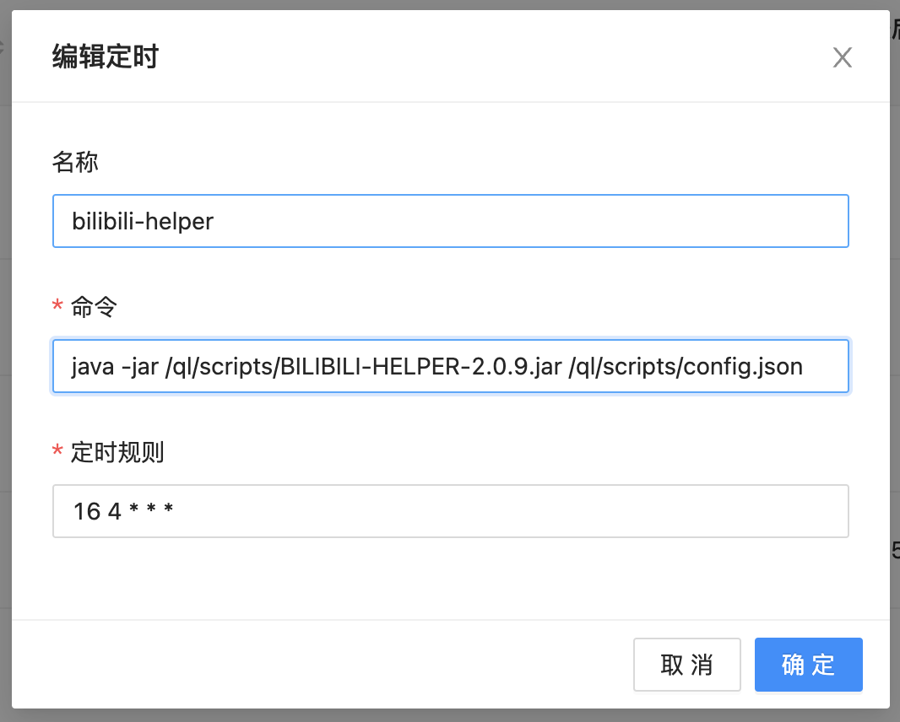

## 青龙使用教程

**青龙一键拉取命令 `ql raw https://raw.githubusercontent.com/Oreomeow/bili/main/bilibili_helper.sh`**

感谢 [issues/51](https://github.com/JunzhouLiu/BILIBILI-HELPER-PRE/issues/51) @graytoowolf 提供的方案。

<details>
<summary>使用一键脚本后该处可不看</summary>

### 下载 Release 包备用

点击 [Release](https://github.com/Oreomeow/bili/releases/)，下载名称为 `BILIBILI-HELPER-v2.x.x.zip` 的 zip 压缩包到本地，解压后备用。

ps: 只需要 `BILIBILI-HELPER-v2.x.x.jar` 和 `config.json` 这两个文件。

### 在青龙中安装 openjdk

新建一个定时任务，并执行。此任务可执行完可删除。


* **任务名：** install openjdk

* **命令：** `apk add openjdk8`

* **定时：** `10 8 20 * *`

### 上传文件

将 `BILIBILI-HELPER-v2.x.x.jar` 和填写好的 `config.json` 这两个文件放到 `/ql/scripts` 目录（物理机放到容器此目录对应的映射目录即可）。

</details>

### 创建海尔破定时任务



* **任务名：** 运行海尔破

* **命令：** `java -jar /ql/scripts/BILIBILI-HELPER-2.1.2.jar /ql/config/java_conf.json`

* **定时：** `10 8 * * *`

~~如果 `/ql/scripts` 目录已经存在 `config.json` 文件，可将 config.json 改名，在执行命令后指定对应的文件即可。~~

~~例如将 `config.json` 改名为 `bilibili.json` ，对应的执行命令则是 `java -jar /ql/scripts/BILIBILI-HELPER-v2.0.9.jar /ql/scripts/bilibili.json`~~

### 日志查看

**如果需要查看日志请在青龙管理面板-任务日志找到 java 目录查看执行日志**

如果需要运行时查看日志请创建一个 `bili.sh` 脚本，放置到 `/ql/scripts` 目录，并将定时任务的执行命令修改为 `task bili.sh` 即可，请将 sh 文件中路径，文件名改为你实际的路径文件名（均为容器内的路径）。

```sh
#!/usr/bin/env bash
java -jar /ql/scripts/BILIBILI-HELPER-v2.1.2.jar /ql/config/java_conf.json
```
